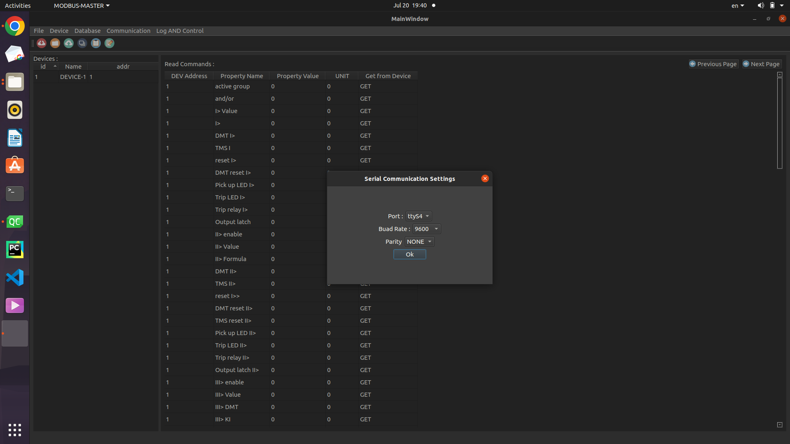
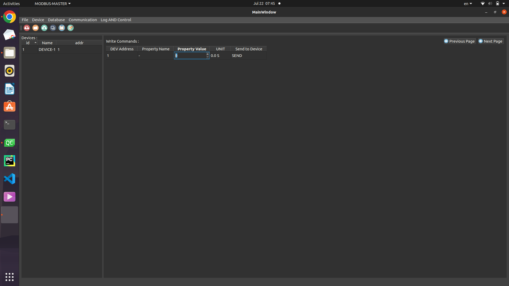

# MODBUS-Master-App
This is an applicatin written in Qt as a modbus master. It has databases which user creates, and with these databases user can connect to slave devices and read or write its properties. Users can save, modify and open projects when nedded.    

